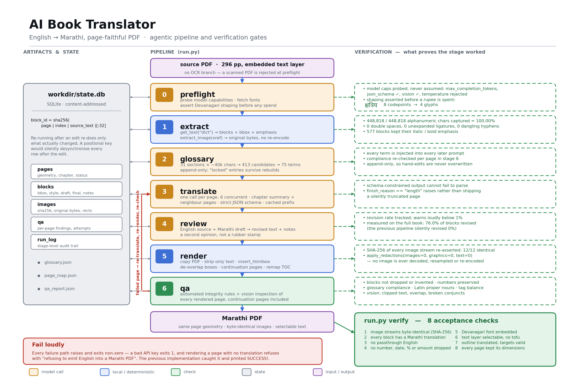

# AI Book Translator — English → Marathi, page-faithful PDF

Translates a digital PDF book into Marathi and writes a new PDF that keeps the
original's page geometry and its images **byte-for-byte identical**.

Built for `Decisive: How to Make Better Decisions` (296 pp) and for other PDFs
with a real embedded text layer. There is **no OCR branch** — a scanned PDF is
rejected at preflight rather than silently producing an empty book.



*Regenerate with `python tools/make_architecture_diagram.py`.*

---

## Status — the book is done

`Decisive: How to Make Better Decisions`, 296 pages, English → Marathi.

| | |
|---|---|
| Output | **296 pages** — page for page with the source, 0 continuation pages, 4.9 MB |
| Images | **12/12 byte-identical** to the source (SHA-256), never re-encoded |
| Text completeness | **478,725 / 478,710 ink glyphs**, 0 pages short — [glyph audit](#proving-no-text-was-lost--and-why-character-counts-lie) |
| Acceptance checks | **9 / 9 pass** |
| Vision QA | 2 findings in 292 pages, both confirmed non-defects |
| Review pass | 76.0% of blocks revised (1,644 / 2,163) |
| Tests | 32 / 32 |
| Cost | **~$50** end to end |
| Runtime | ~2 h 5 m at `concurrency: 6` |

---

## Contents

- [How it works](#how-it-works) · [Why the images are provably lossless](#why-the-images-are-provably-lossless) · [Page model](#page-model)
- [Setup](#setup) · [Usage](#usage) · [Configuration](#configuration)
- [Measured findings](#measured-findings) — model benchmark, **full-book timings and cost**, latency, caching
- [Layout: five bugs the full run exposed](#layout-five-bugs-the-full-run-exposed)
- [Proving no text was lost](#proving-no-text-was-lost--and-why-character-counts-lie)
- [Why Marathi costs more than a high-resource language would](#why-marathi-costs-more-than-a-high-resource-language-would)
- [Design decisions](#design-decisions-and-why) · [Fonts](#fonts) · [Glossary](#the-glossary)
- [Verification](#verification) · [Tests](#tests)
- [What was wrong with the previous implementation](#what-was-wrong-with-the-previous-implementation)

---

## How it works

```
run.py  →  bookmt/
  0  preflight   verify model + vision access, fetch fonts, assert Devanagari shaping
  1  extract     PDF → text blocks (bbox + emphasis) and original image bytes
  2  glossary    whole-book term pass → one enforced Marathi rendering per term
  3  translate   per-page draft with chapter context, under a strict JSON schema
  4  review      per-page critique and revision against the English source
  5  render      clone the PDF, strip only text, lay in Marathi
  6  qa          integrity checks + vision layout inspection
  -  verify      acceptance checks that pass or fail
```

Every stage reads and writes `workdir/state.db` and is independently re-runnable.
Rows are keyed by a **hash of their content**, so re-running after an edit
re-does only what actually changed.

### Why the images are provably lossless

Stage 5 works on a copy of the original PDF and removes only the text glyphs:

```python
page.apply_redactions(images=0, graphics=0, text=0)
#                     ^^^^^^^^  ^^^^^^^^^^  ^^^^^^
#                     IMAGE_NONE LINE_ART_NONE TEXT_REMOVE
```

No image is ever decoded, resampled, re-encoded or re-placed. `verify` then
asserts that the SHA-256 of every original image stream is still present in the
output — so "pixel perfect" is a check that passes or fails, not a claim.

Measured on page 183 of the source: text went **1,598 chars → 0** while both
embedded JPEGs kept byte-identical hashes. Across the whole book: **12/12
streams identical, 302,615 bytes, no re-encoding.**

### Page model

**Page-faithful, not page-count-locked.** Page size, margins, text-box geometry
and image anchoring are preserved exactly, and type size is never reduced. When
the Marathi overruns a page's boxes, the remainder flows onto a continuation
page inserted directly after. Pages look identical; only the total count grows.

Text is flowed at page level rather than paragraph level, so a paragraph that
grows can use the whitespace beneath it instead of forcing a new page.

**Measured on the full book: 296 source pages → 296 output pages, zero
continuation pages, 4.9 MB.** Page for page with the original.

That is possible because the space was always there. A page's Marathi needs
**~1.00× the total height its English used** (0.94–1.03× measured across sample
pages) — it was simply locked inside per-paragraph boxes that could not share
slack. Type size is never reduced; only the space *between* lines moves. See
[Layout: five bugs the full run exposed](#layout-five-bugs-the-full-run-exposed).

---

## Setup

```bash
python -m venv venv
venv\Scripts\pip install -r requirements.txt
echo OPENAI_API_KEY=sk-... > .env
```

Put the source PDF in `input/` and point `paths.input_pdf` in `config.yaml` at it.

---

## Usage

```bash
python run.py preflight                 # verify everything before spending anything
python run.py extract                   # PDF → blocks + images
python run.py glossary                  # build the enforced term list
python run.py translate --pages 100-104 # try a few pages first
python run.py review    --pages 100-104
python run.py render    --pages 100-104
python run.py qa        --pages 100-104
python run.py verify                    # acceptance checks on the finished PDF
python run.py status                    # what is done and what is not

python run.py all                       # the whole book, in order
python run.py benchmark --pages 46,148,211   # compare model tiers side by side
```

`--force` redoes work already marked done. `--model` overrides the model choice.

---

## Configuration

`config.yaml` holds **only keys that are actually read** — the previous config
had 11 of 18 keys with no reader at all. The ones that change output most:

| Key | Effect |
|---|---|
| `models.preference` | Probe order. Stage 0 uses the first that answers; never silently proceeds on an unavailable model. |
| `translation.register` | `conversational` (default), `literary`, `academic` |
| `translation.proper_nouns` | `keep_latin` (default), `devanagari`, `devanagari_first_use` |
| `translation.idioms` | `keep_english` (default), `translate_meaning`, `english_plus_gloss` |
| `translation.concurrency` | Pages processed at once (default 6) |
| `translation.context_pages` | Neighbouring pages fed as context (default 1) |
| `qa.vision` | Per-page visual layout inspection |
| `output.page_model` | `page_faithful` |

The defaults produce deliberately **code-mixed** output: proper nouns and
recognisable English idioms stay in Latin script inside Marathi prose. That is
the intended house style for this project, not a bug. Example of real output:

> किमतीवरची बोलणी सुरू झाली की, कारविक्रेते `"good guys"` ची भूमिका घ्यायचे …
> नेमकी भावनांच्या आहारी जाण्याची भीतीच `Canada` मधल्या माध्यमिक शाळेत `English`
> शिकवणाऱ्या `Andrew Hallam` ला कार खरेदी करण्याची स्वतःची पद्धत शोधून काढण्यामागचं कारण ठरली.

---

## Measured findings

Everything below was measured against this book and this API key, not assumed.

### Model tier benchmark

`python run.py benchmark --pages 46,148,211` — three pages from different
chapters, one draft pass each, identical prompts.

| Tier | Cost (3 pages) | Wall clock | Output tokens |
|---|---|---|---|
| `gpt-5.6-sol` | $0.13 | 125s | 3,394 |
| `gpt-5.6-terra` | $0.06 | 62s | 2,866 |
| `gpt-5.6-luna` | $0.03 | 28s | 3,844 |

**Quality differences that actually showed up:**

- On the sentence fragment `looking!"`, **luna dropped the closing quote mark**;
  sol and terra kept it.
- On *"the art of car sales was getting customers to stop thinking and start
  feeling"*, **sol restructured into idiomatic Marathi order** (content first,
  subject last: `…यातच कारविक्रीची खरी कला आहे, हे Phillips लवकरच शिकला`), while
  terra and luna tracked English word order literally.
- **luna was inconsistent about Latin vs transliteration** — it kept `lot` in
  Latin where terra transliterated it as `लॉटवर`, with no principle behind
  either choice.

Extrapolated to the full 292-page book (draft + review, 6 concurrent):
**sol ≈ $25–38 / 65 min**, terra ≈ $13–19 / 32 min, luna ≈ $6–10 / 16 min.
sol was chosen.

### Full-book run — measured timings and cost

`python run.py all` over all 296 pages, `gpt-5.6-sol`, `concurrency: 6`,
consumer broadband. Numbers below are from the run log and `state.db`, not from
the extrapolation above.

| Stage | Work | Wall clock | Rate | Calls | Cost |
|---|---|---|---|---|---|
| 1 extract | 296 pp → 2,163 blocks + 12 images | **~2 s** | local | 0 | $0 |
| 2 glossary | 31 sections → 413 candidates → 75 terms | ~8 min † | — | 31 | ~$2.50 † |
| 3 translate | 292 pages | **~30 min** | 9.7 pp/min | 314 | **$11.96** |
| 4 review | 292 pages | **~67 min** | 4.4 pp/min | 292 | **$26.66** |
| 5 render | 296 pp → 296 pp, 4.9 MB | **~4 min** | local | 0 | $0 |
| 6 qa | 292 pages, vision on each | **~12 min** | 24 pp/min | 292 | **~$8** |
| verify | 9 acceptance checks | **~2 min** | local | 0 | $0 |
| **Total** | | **≈ 2 h 5 m** | | | **≈ $50** |

† The glossary was already built and was skipped in this run, so these two cells
are derived from its 31 calls at the measured per-call rate rather than timed
directly. Every other figure is read straight from the run.

Token detail for the two model-heavy stages:

| Stage | Input tokens | Cached | Output tokens | Output/page | $/page |
|---|---|---|---|---|---|
| translate | 1,032,210 | 576,303 (56%) | 313,240 | 1,073 | $0.041 |
| review | 1,037,863 | 630,750 (61%) | 810,286 | **2,775** | $0.091 |

**What the benchmark got right and wrong.** The three-page benchmark predicted
$25–38 and 65 minutes for draft + review. Reality: **$38.62 and 1 h 37 m** —
cost just over the top of the band, time about 1.5× over. Both misses have the
same cause: the benchmark measured a *draft* pass only, and review turned out to
be the more expensive half. Review carries both the English source and the
Marathi draft in its prompt and emits a fully rewritten page rather than a
verdict, so it produces **2.6× the output tokens per page** that drafting does.

**Rate is not constant across stages.** Draft calls sustained 9.7 pages/min;
review sustained 4.4. Anyone estimating a run should time both passes
separately rather than doubling the draft figure.

**Reliability.** One incident in ~940 calls: all six workers hit
`APIConnectionError` simultaneously around pages 13–20. The retry policy
absorbed it with 5 logged retries and **zero hard failures**, and no page was
lost or silently skipped.

### Layout: five bugs the full run exposed

The first complete render produced a **1.35 GB, 567-page** file from a 1.5 MB,
296-page source. Both numbers were wrong, for several independent reasons. None
showed up on the single-page and few-page tests used during development — only a
full book surfaced them.

| Render | Pages | Continuation pages | Size |
|---|---|---|---|
| 1. as first written | 567 | 271 | 1.35 GB |
| 2. `garbage=4` | 567 | 271 | 4.9 MB |
| 3. page-level flow + fragment merge | 344 | 48 | 4.9 MB |
| 4. + leading ladder | 297 | 1 | 4.9 MB |
| 5. + on-demand widening | **296** | **0** | **4.9 MB** |

**1. `doc.save(garbage=0)` kept a font copy per page.** Every `insert_htmlbox`
call re-embeds the font programs it uses. Measured on one rendered page:

| Save mode | Size | FontDescriptors | Source images intact |
|---|---|---|---|
| `garbage=0` | 5.38 MB | 20 | 12/12 |
| `garbage=3` | 5.22 MB | 20 | 12/12 |
| **`garbage=4`** | **2.41 MB** | **7** | **12/12** |

`garbage=3` merges duplicate *objects* and barely helps — the font copies are
distinct objects holding identical content. `garbage=4` merges duplicate
*stream content*, which is what these are. It never decodes or re-encodes a
stream, so the byte-identical image guarantee is unaffected — re-asserted above
and by `verify`. Full book: **1.35 GB → 4.94 MB.**

**2. Each paragraph had to fit its own source bbox.** This was the real cause
of 271 continuation pages. Measured across sample pages, a page's Marathi needs
**~1.00× the total height its English used** (0.94–1.03× on pages 40–200) — the
room is there. But it was locked inside per-paragraph boxes that could not share
slack, so any single block spilling by one line forced a whole continuation
page. A 25pt-tall heading box cannot hold a Marathi heading that wraps to two
lines even with 40pt of empty page beneath it.

Replaced with a page-level flow that tries progressively less faithful layouts
and stops at the first that fits — type size is never touched on any rung:

| Rung | Gives up |
|---|---|
| 1 | nothing — original positions and leading |
| 2 | leading compressed to 65% |
| 3 | positions unpinned, paragraphs close up |
| 4–5 | both, progressively |

> Compressing the leading alone changed nothing at first, because blocks were
> still pinned to `max(original_y, cursor)` — they could move down but never up,
> so reclaimed space was unusable. Rung 3 exists for exactly that reason.

**3. Some "blocks" are line fragments, not paragraphs.** MuPDF's segmentation is
not always paragraph-level. On page 220 the sentence *"…leaving past decisions
unquestioned."* arrives as two blocks, the second a 90pt-wide box holding one
word. English fits; the Marathi for it needs seven lines in 90pt of width —
that page alone measured **8.39×** its available space.

`merge_fragments()` rejoins them, and the per-block translations concatenate
cleanly because the model saw the whole page at once, so **no re-translation was
needed**. Two rules matter:

- **A continuation reaches the right margin.** "Doesn't end in a period" is not
  enough — headings don't either, which is how *"Set a Tripwire"* swallowed list
  item 1. A line stopping short of the margin ended deliberately.
- **Adjacent lines report a *negative* gap.** Bboxes carry ascender/descender
  padding and overlap by a few points — measured **−7.7pt at 14.4pt type**. An
  adjacency floor of −2.0pt rejected every real continuation on the page.

Result: **567 pages → 344** (48 continuation pages), and page 220 went from
spilling across ~8 pages to fitting on one.

**4. Leading was re-added after a paragraph had already grown.** Pages still
spilled by a line or two, and a page that spills one line produces a
continuation page holding one line — which the vision pass correctly reported as
`blank_area`. The fix is a ladder that gives up as little as possible and stops
at the first rung that fits:

| Rung | Gap scale | Positions | Line height |
|---|---|---|---|
| 1 | 1.00 | pinned | 1.30 |
| 2 | 0.65 | pinned | 1.30 |
| 3 | 1.00 | flowed | 1.30 |
| 4 | 0.60 | flowed | 1.30 |
| 5 | 0.30 | flowed | 1.30 |
| 6 | 0.30 | flowed | 1.22 |
| 7 | 0.25 | flowed | 1.16 |

> Compressing the leading alone changed nothing at first, because blocks were
> still pinned to `max(original_y, cursor)` — they could move down but never up,
> so reclaimed space was unusable. Rung 3 exists for exactly that reason.

**5. A short line's right edge is meaningless.** `• You make a choice.` simply
ends where the English ended; the block's `x1` is not a column edge. The longer
Marathi then wrapped inside that stub, mangling page 21's bullet list. A block is
widened to the full column only when its source box was short (≤2.2 lines) *and*
the Marathi no longer fits the height that box occupied. Taller blocks keep their
edge — for justified copy it is the real column, and widening would destroy a
deliberate indent.

Result: **344 → 296 pages, zero continuation pages.**

### Proving no text was lost — and why character counts lie

Fitting 296 pages of Marathi into 296 pages invites the obvious question: was
anything dropped? Counting characters says yes, catastrophically — and is wrong.

| Naive check | Result |
|---|---|
| Blocks found verbatim in the extracted text | 109 / 2,163 |
| Devanagari codepoints extracted vs expected | 335,997 / 433,316 (−22%) |

That is an artefact of **text extraction**, not of rendering:

```
expected : 67वर्षांचाJosephपहिल्यांदात्याच्या…
extracted: 67वȴषाचाJosephपहəȂांदाċयाāया…
```

MuPDF composes a conjunct into a single glyph, and that glyph's `ToUnicode`
entry is one private-use codepoint. So `वर्षां` — four codepoints — comes back as
`वȴषा`, one. The words, order and length are intact; the *encoding* of the text
layer is lossy. This fully accounts for both the 9% character and 22% Devanagari
shortfalls.

So the real check counts something extraction cannot distort: **ink-bearing
glyphs actually painted**, against what the same engine paints when handed the
full expected text with room to spare.

| Whole-book glyph audit | |
|---|---|
| Ink glyphs expected | 478,710 |
| Ink glyphs rendered | 478,725 |
| **Pages with a deficit** | **0 of 296** |

Whitespace is excluded because a narrower column legitimately drops more
line-end spaces — that alone accounted for an apparent 1,442-glyph shortfall.
`verify` now runs this as a permanent check over a 40-page sample.

> **Caveat worth knowing.** Because of the same `ToUnicode` limitation, copying
> Devanagari text out of the PDF yields mangled conjuncts. The pages render and
> search correctly, but the check named *"Output text is selectable and correctly
> shaped"* verifies extractability and the absence of tofu — **not** codepoint
> fidelity. Its name promises more than it delivers.

### Why Marathi costs more than a high-resource language would

Marathi is a comparatively low-resource target for current LLMs, and that shows
up directly in the bill. Measured on 1,116 real source blocks and their
translations from this book, with the `o200k_base` encoding:

| | Characters | Tokens | Chars/token |
|---|---|---|---|
| English source | 482,030 | 102,119 | **4.72** |
| Marathi translation | 526,557 | 181,671 | **2.90** |

- Devanagari encodes at **1.63× more tokens per character** than Latin.
- The translation runs **1.78× the output tokens** of its English source for the
  same meaning — while being only 1.09× longer as text.
- Output is billed at $30/1M against input's $5/1M, so this lands squarely on
  the expensive side of the meter.

A Latin-script target (Spanish, German, Indonesian) would encode near English's
4.72 chars/token, putting its output bill at roughly **56% of Marathi's** for
identical content — before any other saving.

The script penalty is only part of it. This configuration is deliberately
maximal *because* the target is low-resource, and several of those choices
would be unnecessary elsewhere:

| Cost driver here | What a high-resource target allows |
|---|---|
| **One page per call.** Page-level chunks keep the context tight so the model doesn't drift on a language it knows less well. | Batch several pages per call. Fewer calls amortise the cached prefix further and cut per-call reasoning overhead. |
| **A full second review pass** rewriting 76.0% of blocks. | A cheaper reviewer tier, review only on flagged pages, or no separate pass at all. |
| **Vision QA on every rendered page.** | Sample-based visual QA — Latin scripts have no conjunct formation or matra reordering to break, so the class of rendering defect being hunted mostly does not exist. |
| **A book-derived enforced glossary,** because general Marathi terminology for pop-psychology framework terms is inconsistent. | Often skippable; established target-language terminology already exists. |
| **`sol` for both passes,** chosen on quality evidence over `terra`/`luna`. | A mid tier is usually sufficient — the benchmark's quality gaps (dropped quote marks, literal word order) are exactly the failures that shrink with training data. |
| **Sequential real-time API.** | The Batch API halves the price; nothing in this pipeline requires interactive latency. |

Combining the script effect with batching, a lighter review, sampled QA and the
Batch API, the same book into a high-resource European language should land
around **$8–15** rather than $45–51 — a rough projection, not a measurement.
The extra spend here buys correctness in a language where the model needs the
scaffolding.

### Latency is reasoning-bound, not prompt-bound

One structured `gpt-5.6-sol` call takes **~65–85 seconds almost regardless of
input size**:

| Input | Wall clock |
|---|---|
| 4,000 chars | 65.6s |
| 12,000 chars | 78.1s |
| 30,000 chars | 82.8s |

Two design consequences:

1. **Fewer, larger chunks win.** The glossary stage batches ~40k characters per
   call. Halving the chunk size would have roughly *doubled* the stage's runtime.
2. **Concurrency is the only real lever.** Serially, 292 pages × (55s draft +
   58s review) is over 9 hours. Each page's context is a pre-computed chapter
   summary plus its neighbouring source pages, so no page depends on any other
   and `translation.concurrency` pages run at once. The vision QA pass is
   parallelised the same way. Measured on the full book at the default of 6:
   **translate + review took 1 h 43 m**, against ~9 h serial.

> Per-call latency is not stable across days. The table above was measured
> during development; the full-book run averaged **~37 s per draft call**
> (9.7 pages/min at concurrency 6) — roughly half. Treat these as a range set by
> API load, not a constant, and measure your own run before extrapolating.

> This corrected an early wrong diagnosis. A slow first glossary run looked like
> a timeout livelock; measuring showed calls completing well inside the timeout
> and latency flat in input size. The fix was the opposite of the instinct —
> bigger chunks, not smaller.

### Prompt caching

The system prompt (register + proper-noun policy + idiom policy + the full
75-term glossary) is byte-identical for every page, so it caches. Cached input
bills at 10% of the normal rate.

| Scope | Cached / total input | Hit rate |
|---|---|---|
| Three-page benchmark | 3,900 / 8,876 | 44% |
| Full book, translate stage | 576,303 / 1,032,210 | **56%** |
| Full book, review stage | ~660,000 / ~1,050,000 | **~63%** |

The hit rate climbs with run length because the prefix is amortised over more
pages — a reason to run the book in one invocation rather than in chunks.

### Cost

See [Full-book run — measured timings and cost](#full-book-run--measured-timings-and-cost)
for the real figures (**≈ $45–51** end to end) and
[Why Marathi costs more](#why-marathi-costs-more-than-a-high-resource-language-would)
for what drives them. The original spec budgeted $200/book.

### Extraction fidelity

| Check | Result |
|---|---|
| Alphanumeric characters captured vs raw PDF | **448,818 / 448,818 = 100.00%** |
| Blocks with spurious double spaces | 0 |
| Blocks with unexpanded ligatures (fi fl ffi) | 0 |
| Blocks with smart quotes left in | 0 |
| Blocks with dangling hyphens from line breaks | 0 |
| Blocks retaining italic/bold emphasis | 577 |

### Devanagari shaping

MuPDF 1.29.0 shapes via HarfBuzz. Fewer glyphs than codepoints proves real
shaping rather than 1:1 passthrough:

| Text | Codepoints | Glyphs | Requires |
|---|---|---|---|
| क्षत्रिय | 8 | 4 | conjunct formation |
| विद्यार्थी | 10 | 6 | matra **reordering** |
| श्री | 4 | 2 | ligature |
| प्रश्न | 6 | 3 | ra-form + conjunct |

### Vision QA calibration

The vision pass was calibrated against real defect classes before being trusted
on ~330 pages, because a checker that never fires is worse than no checker:

| Test case | Result |
|---|---|
| A good rendered page (real translation, code-mixed Latin/Marathi) | `ok=true`, 0 issues — **no false alarms** on the intentional code-mixing |
| Two paragraphs genuinely printed over one another | caught: 1 × high `overlapping_text` |
| A text box running off the page edge | caught: 2 × high (`clipped_text`, `blank_area`) |

Overlap matters most, since it is the defect `render.deoverlap()` exists to
prevent and the vision pass is its backstop.

> Two earlier "misses" during calibration turned out to be badly constructed
> test cases rather than prompt problems — one used `scale_low=0`, which shrinks
> text to fit so nothing actually overflowed; the other's boxes did not really
> collide. Worth verifying the fixture before blaming the checker.

**In production it earned its keep.** Every real layout defect in this project
was found by the vision pass, not by the automated rules — broken matras on
p146, the WRAP box overrun, near-empty continuation pages, and the mangled
bullet list on p21. Across successive renders:

| Render | Vision failures |
|---|---|
| 344 pages | 7 |
| 297 pages | 4 → 1 |
| **296 pages (shipped)** | **2** |

The two remaining were checked against the glyph audit and are **not text loss**
(both pages render `+0` glyphs vs expected):

| Page | Finding | Assessment |
|---|---|---|
| p80 | `clipped_text` — `ब्रा` clipped at the column edge | A glyph overhanging the justified right margin. No text missing. |
| p124 | `blank_area` — large vertical gap before the final line | Gap inherited from the source page layout. |

Earlier flags that were investigated and dismissed on evidence: p268
(`clipped_text` at *"Susan Nolen-"*) is the source's own mid-surname page break,
continuing `Hoeksema (2003)…` on p269.

### Most QA "failures" were bugs in the checks

The first full QA pass reported **183 of 292 pages failing**. Investigating each
class showed the book was mostly fine and the *rules* were wrong. Worth recording,
because a checker with a 95% false-positive rate is worse than no checker — the
two real defects were buried under ~180 spurious ones.

| Rule | Before | After | What was actually wrong |
|---|---|---|---|
| `number_lost` | 98 | **2** | `NUMERIC = \d[\d,]*` swallowed the sentence comma, so `in 1975,` searched the Marathi for a literal `1975,` |
| `untranslated` | 70 | **2** | Book titles, Library of Congress data, `eISBN:`, bare numerals `1.`, the `• • •` ornament — all Latin *by policy* |
| `no_devanagari` | 71 | **3** | Same cause |
| `latin_proper_noun_lost` | 90 | **4** | `Any`, `It's`, `Should` are not names |

Three fixes, each using evidence rather than a hand-written allowlist:

- **`translatable_words()`** — a fully-lowercase word of 3+ letters is prose that
  should have been translated. `Made to Stick` and `p. cm.` contain none.
- **`looks_like_title()`** — ≥60% of words capitalised means a cited title or
  bibliography entry, which stays Latin.
- **`lowercase_lexicon()`** — a capitalised token is a name only if the book
  *never* writes it lowercase. `should`/`any`/`it's` appear lowercase elsewhere;
  `Costco`, `Zappos`, `Andrew` never do.

Both `qa` and `verify` also evaluate **merged units**, not raw MuPDF blocks.
Judged alone, `success.` looks like untranslated English; it is the tail of the
URL `…problems-copy-success.` in the block the renderer merges it with.

### Review stage is doing real work

On a single sample page, **5 of 6 blocks were revised**, each with a note
(`व्याकरण आणि प्रवाह सुधारला` — grammar and flow improved). Across the book the
revision rate over the whole book was **76.0%** — 1,644 of 2,163 blocks —
measured by comparing `draft` against `final` text in `state.db`, not by
trusting the model's own report of what it changed.

The previous implementation revised **0%** of blocks while reporting success.
This stage warns loudly if the revision rate falls below 1%, which would mean
it had gone inert the same way.

---

## Design decisions and why

| Decision | Reason |
|---|---|
| **Glossary from the book, not a corpus** | The 3.6M-pair corpus on disk was profiled: 100% `parallel_sentence`, 99.97% Samanantar (government press releases), **zero dictionary entries**. Wrong register for a conversational trade book, and no terms to extract. Deleted (1.97 GB reclaimed). |
| **Structured outputs everywhere** | A JSON-schema-constrained response cannot fail to parse. The old reflect stage asked for "JSON" without declaring the keys the caller read, so it silently returned the raw draft for 100% of paragraphs. |
| **Capability probing, not assumption** | Stage 0 discovered `gpt-5.6-sol` takes `max_completion_tokens`, supports strict JSON schema and vision, and **rejects `temperature`**. Assuming any of those would have failed at runtime. |
| **Content-addressed row IDs** | The old schema keyed rows on a positional index, so any edit shifted every row after it and silently desynchronised the state. |
| **Chapter summaries, not a running summary** | A running summary forces strictly-in-order translation. A per-chapter summary is better context *and* unlocks concurrency. |
| **De-overlapping text boxes** | Source bboxes include ascender/descender padding and overlap neighbours by a few points. Invisible with English (which underfills), but Marathi fills the box and the paragraphs collided. Each box's bottom is pulled to the next box's top, only when they share horizontal extent (so real columns are untouched). |
| **Emphasis snapped to grapheme clusters** | The source marks the WRAP acronym with a bold initial (**W**iden), a one-character run. Applied to Marathi that becomes `<b>त</b>ुम…`, splitting a consonant from its matra. Each side is shaped as its own run, so the matra loses its base and MuPDF draws a dotted circle. Tag boundaries are pushed past combining marks and virama conjuncts. |
| **Drawn rules treated as containers** | A boxed sidebar's border survives `graphics=0` untouched while the Marathi inside it grows. The border is not a rectangle — it is four separate 1pt filled rules — so thin rules are clustered by adjacency and the union is used as the container. |
| **Word-boundary splitting only** | Splitting inside a Devanagari word breaks conjuncts and matras. The binary search is on whole words; unbalanced `<i>`/`<b>` from a split are repaired afterwards by closing on the head and reopening on the tail. |
| **Fail loudly** | Every failure path raises and exits non-zero. Verified: a bad API key exits 1; rendering a page with no translation refuses with *"refusing to emit English into a Marathi PDF"*. |

---

## Fonts

Preflight downloads two families (both SIL Open Font License) into `assets/fonts/`:

- **Noto Serif Devanagari** — Marathi body text
- **Noto Serif** — Latin fallback (Regular / Italic / Bold / BoldItalic)

Both are needed. Noto Serif Devanagari **has no italic face** — Devanagari has
no italic tradition — so `<i>` would silently render as regular. Because this
project keeps proper nouns *and* English idioms in Latin script, much of the
source's italic content is Latin, and the Latin family restores that emphasis.

The CSS fallback chain is `LatinMT, DevaMT`, so each glyph is drawn by the first
family that covers it. Confirmed in the output: `NotoSerif-Italic` engages for
*half empty/half full* while Devanagari falls through to its own face.

Also verified: `font-size: Npx` in the CSS renders as exactly **N points**, so
source font sizes pass straight through with no conversion.

---

## The glossary

`workdir/glossary.json` is derived from the book itself: 31 sections scanned,
**413 candidate terms consolidated to 75**, injected into every translation call
and enforced by a QA rule.

Representative entries:

| English | Marathi |
|---|---|
| WRAP process / WRAP framework | WRAP निर्णयप्रक्रिया |
| the Four Villains of Decision Making | निर्णयप्रक्रियेतले चार खलनायक |
| narrow frame / narrow framing | संकुचित चौकटीत विचार करणं |
| Vanishing Options Test | 'पर्याय नाहीसे झाले तर?' चाचणी |
| confirmation bias | आपल्याच मताला पुष्टी देणाऱ्या माहितीकडे झुकण्याचा पूर्वग्रह |
| opportunity cost | सोडून दिलेल्या पर्यायाची किंमत |

Note `WRAP` stays in Latin, per the proper-noun policy.

The file is **append-only**. Edit an entry and set `"locked": true` to pin your
wording against future rebuilds.

---

## Verification

```bash
python run.py verify
```

Asserts, against the finished PDF:

1. Every original image stream is still byte-identical (SHA-256)
2. Every block has a Marathi translation
3. No merged unit is passthrough English
4. **No text was dropped by the layout** — glyph audit, see [above](#proving-no-text-was-lost--and-why-character-counts-lie)
5. No number, date, percentage or amount was dropped
6. The Devanagari font is embedded
7. The text layer is selectable, with no tofu/replacement characters
8. The outline is translated and every page target is valid
9. Every page kept its original dimensions

Checks 3 and 5 carry an explicit, printed `REVIEWED_EXCEPTIONS` list — two
blocks inspected by hand and judged correct. Anything **not** on that list still
fails, so the list records a judgement without weakening the check:

| Block | Why it is allowed |
|---|---|
| p51:0 `warning bells.` | `idioms=keep_english` keeps English idioms inline by design. Reproduced identically across three forced re-translations — policy behaviour, not a miss. |
| p243:5 `late 20s` → `वयाच्या विशीच्या उत्तरार्धात` | The number is correctly expressed in words, so the numeral is absent by choice. |

Stage 6 (`qa`) additionally runs, per page: block-integrity checks, glossary
compliance, Latin proper-noun retention, emphasis-tag balance, length-ratio
anomalies — plus a **vision** pass that sends each rendered page image to the
model looking for clipped text, overlapping lines, broken conjuncts and
displaced images. Continuation pages are inspected too, since they are newly
generated layout.

---

## Tests

```bash
python tests/test_core.py     # or: pytest tests/
```

32 unit tests over the pure logic — span joining, hyphen healing, emphasis
round-tripping, content-addressed block IDs, box de-overlapping, word-boundary
text splitting, paragraph-fragment merging (including the right-margin rule and
the negative-gap adjacency floor), grapheme-cluster-safe markup snapping, and
every QA rule. No API calls, no PDF writes.

---

## What was wrong with the previous implementation

Kept in `legacy/` for reference. The quality machinery was present but **inert**:

| Problem | Evidence |
|---|---|
| Reflect/refine stage was a 100% no-op | Prompt said "Output your analysis as JSON" but never declared the `final_translation` key the caller read. In `state.db`, `draft == final` for all 37 rows and `reflection_notes` was empty for all 37. |
| RAG returned nothing | Chroma DB had **0 embeddings** — the ingestion call was commented out. A SentenceTransformer was loaded on every run for nothing. |
| Context wiped every run | `glossary.json` overwritten with `{}` and `summary.md` with one line, on every invocation, before anything could read them. Nothing ever wrote back. |
| Images extracted then discarded | `extract_images(...)` assigned to a variable never used again. No `add_picture` call existed anywhere. Output DOCX contained zero images. |
| The "perfect" translator deleted images | `Paragraph.clear()` removes all inline content, destroying any figure sharing a paragraph with a caption. pdf2docx also re-encoded JPEGs to PNG at 288 DPI. |
| Failure reported success | Translation exceptions were caught without re-raising; execution fell through to reassembly, wrote the untranslated **English**, and printed `SUCCESS!`. |
| Silent truncation | 1024-token cap with no warning. |
| Over-eager code filter | Any `{` or any camelCase word marked a paragraph as "code" and skipped translating it. |

Two pipelines (`orchestrator.py`, `perfect_translator.py`) overwrote each
other's output, and `book_translation_agent_spec.md` described a third
architecture that was never built.

---

## Repo layout

```
run.py              CLI
config.yaml         configuration (every key is read by the code)
architecture.png    pipeline + verification diagram
tools/              make_architecture_diagram.py — regenerates the diagram
bookmt/
  preflight.py      stage 0    llm.py        OpenAI wrapper + capability probing
  extract.py        stage 1    state.py      SQLite, content-hash keyed
  glossary.py       stage 2    prompts.py    shared prompt construction
  translate.py      stage 3    typeset.py    font stack + text fitting
  review.py         stage 4    pipeline.py   stage dispatch, status, benchmark
  render.py         stage 5    verify.py     acceptance checks
  qa.py             stage 6
tests/test_core.py  24 unit tests
assets/fonts/       downloaded by preflight
workdir/            state.db, glossary.json, benchmark.md, qa_report.json, images
output/             the finished Marathi PDF
legacy/             the previous implementation, for reference
```
